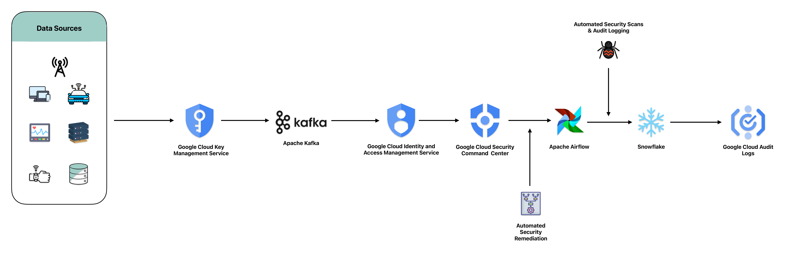

# Enhancing Data Security and Compliance Using GCP, Kafka, Airflow, and Snowflake

### Introduction
In today’s fast-paced digital world, data security and regulatory compliance are critical challenges for businesses handling sensitive customer information. MadHatter Corp., a leader in consumer technology and services, faced significant challenges in protecting its sensitive customer data while ensuring full compliance with stringent industry regulations such as GDPR, HIPAA, and CCPA. Previous data security incidents exposed vulnerabilities in their existing infrastructure, resulting in unauthorized access to personal and financial data, leading to severe financial and reputational consequences.

Recognizing the need for a comprehensive solution, MadHatter Corp. implemented an advanced data security and compliance framework using Google Cloud Platform (GCP), Apache Kafka, Apache Airflow, and Snowflake. This multi-layered approach ensured robust protection of sensitive data, continuous monitoring of activities, and alignment with regulatory standards to mitigate the risk of penalties and breaches.

### Sample Scenario - MadHatter Corp.
MadHatter Corp. was struggling to protect customer information due to an increasing number of data breaches and rising regulatory requirements. With the growing complexity of regulatory frameworks like GDPR, HIPAA, and CCPA, MadHatter Corp. had to ensure strict compliance while also fortifying its infrastructure to protect sensitive customer data from future security incidents. The company’s previous breaches exposed several vulnerabilities, primarily concerning data transmission, encryption, and access controls.

To address these pressing concerns, MadHatter Corp. leveraged the power of GCP, Kafka, Airflow, and Snowflake to develop a state-of-the-art data security and compliance solution. This system not only ensured compliance with industry regulations but also greatly improved the overall security posture of the organization. The solution combined real-time monitoring, encrypted data storage, and secure data transmission while providing thorough audit capabilities for regulatory compliance.

### GCP, Kafka, Airflow, and Snowflake Architecture Overview
The solution used an integrated architecture of GCP’s robust cloud services, Kafka’s data streaming capabilities, Airflow’s workflow automation, and Snowflake’s secure data warehousing to provide enhanced data security, visibility, and continuous compliance monitoring.

### Key Components and Tools

#### 1. Google Cloud Identity and Access Management (IAM)
**Google Cloud Identity and Access Management (IAM)** was at the heart of the solution, ensuring precise access control and policy management. With IAM, the organization could define who had access to what resources and implement fine-grained permissions to meet both internal security requirements and regulatory compliance standards.

**Key Features:**
- **Granular Role-Based Access Control (RBAC):** Implemented RBAC to provide the least privilege access, ensuring that only authorized personnel could access sensitive data.
- **Policy Management:** Utilized IAM’s advanced policy management to enforce access controls that aligned with compliance regulations such as GDPR and HIPAA.
- **Multi-Factor Authentication (MFA):** Enhanced the security of critical accounts by enforcing MFA for all administrative users.

**Use in Project:**
In this solution, GCP IAM was used to create and enforce policies that restricted access to sensitive customer data. By defining role-based policies and requiring MFA for all administrative accounts, MadHatter Corp. reduced the risk of unauthorized access while meeting regulatory requirements.

#### 2. **Google Cloud Key Management Service (KMS)**
**Google Cloud Key Management Service (KMS)** was implemented to manage the encryption of sensitive data, ensuring both data at rest and data in transit were fully protected. KMS simplified encryption management and helped comply with stringent data protection laws.

**Key Features:**
- **Automated Key Rotation:** Automatically rotated encryption keys according to compliance requirements, reducing the risk of key exposure.
- **Integration with Cloud Storage:** Seamlessly integrated with services like Google Cloud Storage and BigQuery to encrypt sensitive data.
- **Access Controls:** Defined fine-grained access policies around who could manage and use encryption keys.

**Use in Project:**
KMS was crucial for encrypting data at rest in storage systems like Google Cloud Storage and Snowflake, ensuring that sensitive personal and financial information was protected from unauthorized access. The automatic key rotation feature simplified ongoing compliance with data protection regulations.

#### 3. **Apache Kafka**
**Apache Kafka** was deployed to securely stream sensitive data between various systems in real-time. Kafka’s ability to handle large volumes of data securely, with support for encryption and authentication, made it ideal for ensuring the integrity of sensitive data in transit.

**Key Features:**
- **End-to-End Encryption:** Ensured all data transmitted via Kafka streams was encrypted, protecting sensitive customer information from interception.
- **Authentication Mechanisms:** Leveraged Kafka’s SASL/SSL protocols for authenticating data streams and ensuring that only trusted entities could transmit or receive data.
- **Scalability:** Provided a scalable platform capable of handling large volumes of sensitive customer data in real-time.

**Use in Project:**
Kafka was used to transmit sensitive data between systems while ensuring encryption and authentication at every stage of the process. This prevented unauthorized access to customer data during transmission, a critical component in maintaining regulatory compliance.

#### 4. **Google Cloud Security Command Center (SCC)**
**Google Cloud Security Command Center (SCC)** was used to monitor and detect potential security threats across MadHatter Corp.’s entire cloud infrastructure. SCC provided a centralized view of vulnerabilities, misconfigurations, and potential threats, enabling swift action to remediate issues.

**Key Features:**
- **Real-Time Threat Detection:** Continuously scanned for vulnerabilities and monitored security posture across GCP resources.
- **Automated Remediation:** Enabled automated workflows to remediate security issues without manual intervention, improving response times.
- **Centralized Security Management:** Provided a unified view of the entire infrastructure’s security posture, helping MadHatter Corp. stay compliant with regulations.

**Use in Project:**
SCC monitored the infrastructure in real-time, detecting any security threats or vulnerabilities. Automated remediation workflows were triggered to resolve issues immediately, ensuring that MadHatter Corp.’s systems remained compliant and secure.

#### 5. **Apache Airflow**
**Apache Airflow** was employed to orchestrate and automate security-related workflows, such as conducting routine security audits, running data encryption tasks, and maintaining audit logs. Airflow’s flexibility allowed for easy integration with other components to ensure smooth, secure operations.

**Key Features:**
- **Workflow Orchestration:** Automated key security processes, including data scanning, compliance audits, and encryption checks.
- **Audit Logging:** Maintained logs of all activities to ensure comprehensive traceability for compliance.
- **Task Scheduling:** Scheduled security workflows to run at regular intervals, ensuring consistent security monitoring.

**Use in Project:**
Airflow automated essential workflows such as periodic data encryption, compliance audits, and audit log creation. This automation reduced the risk of manual errors and ensured compliance with regulatory requirements by maintaining a constant security check on sensitive data.

#### 6. **Snowflake**
**Snowflake** was chosen as the secure data warehouse solution, offering built-in end-to-end encryption, compliance with numerous regulatory frameworks, and extensive audit logging capabilities. Snowflake’s scalability and performance ensured the secure handling of large volumes of sensitive customer data.

**Key Features:**
- **End-to-End Encryption:** All data stored in Snowflake was encrypted at rest and in transit.
- **Compliance Certifications:** Snowflake met regulatory standards for GDPR, HIPAA, and CCPA, ensuring that data protection practices aligned with industry requirements.
- **Audit Logging:** Maintained detailed logs of all data access and modification activities, providing traceability for security audits.

**Use in Project:**
Sensitive customer data was securely stored in Snowflake, where it was encrypted and continuously monitored for compliance. Snowflake’s extensive security and compliance certifications ensured that all data handling practices met regulatory standards, while audit logs provided detailed traceability.

#### 7. **Google Cloud Audit Logs**
**Google Cloud Audit Logs** provided comprehensive logging of all administrative and data access activities, ensuring that MadHatter Corp. could maintain a complete audit trail for regulatory compliance.

**Key Features:**
- **Detailed Event Logging:** Captured all events related to data access, modifications, and administrative activities.
- **Compliance Auditing:** Provided a record of all activities for use in security audits and compliance reporting.
- **Integration with GCP Services:** Seamlessly integrated with other GCP services, providing a unified audit trail.

**Use in Project:**
Google Cloud Audit Logs tracked all administrative activities and data access operations, enabling thorough audits to ensure regulatory compliance. This comprehensive logging capability allowed MadHatter Corp. to provide evidence of compliance during audits and detect any unauthorized activity.

### Outcome
By implementing this security-focused architecture using GCP, Kafka, Airflow, and Snowflake, MadHatter Corp. significantly improved its data security posture and ensured continuous regulatory compliance. The solution protected sensitive data with end-to-end encryption, robust access controls, and real-time monitoring, while automated security processes reduced the risk of human error. 

MadHatter Corp. successfully mitigated security risks, maintained compliance with industry regulations, and restored customer trust. This proactive approach to data security not only safeguarded the company’s data but also reinforced its reputation as a responsible organization committed to data protection and compliance.

### References:
- [Google Cloud IAM Documentation](https://cloud.google.com/iam/docs)
- [Google Cloud KMS Documentation](https://cloud.google.com/kms/docs)
- [Apache Kafka Documentation](https://kafka.apache.org/documentation/)
- [Google Cloud Security Command Center (SCC) Documentation](https://cloud.google.com/security-command-center/docs)
- [Apache Airflow Documentation](https://airflow.apache.org/docs/)
- [Snowflake Documentation](https://docs.snowflake.com/en/)
- [Google Cloud Audit Logs Documentation](https://cloud.google.com/logging/docs/audit)
