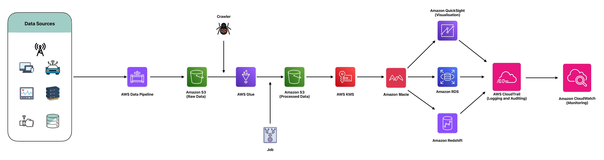

# Data Security and Compliance Solution
With increasing data breaches and stringent industry regulations, ensuring data security and compliance has become a top priority for organizations. Protecting sensitive data and complying with regulations such as `GDPR`, `HIPAA`, and `CCPA` requires robust security measures and continuous monitoring.

## Sample Scenario - MadHatter Corp.
With increasing data breaches and stringent industry regulations, ensuring data security and compliance has become a top priority for organizations. `MadHatter Corp.`, a leader in consumer technology and services, faces significant challenges in protecting sensitive customer data and complying with regulations such as GDPR, HIPAA, and CCPA. As a company handling vast amounts of personal and financial information, MadHatter Corp. must implement robust security measures and maintain continuous monitoring to safeguard data and meet regulatory requirements.

The company has experienced several security incidents in the past, resulting in unauthorized access to sensitive information and subsequent financial and reputational damage. These breaches highlighted the need for a comprehensive security and compliance strategy. Furthermore, as regulatory demands become more stringent, MadHatter Corp. must ensure that its data handling practices are in full compliance with industry standards to avoid substantial penalties and legal repercussions.

To address these challenges, `MadHatter Corp.` developed a solution focused on ensuring data security and compliance using AWS services. The architecture leverages AWS Identity and Access Management (IAM) for access control, AWS Key Management Service (KMS) for data encryption, Amazon Macie for sensitive data discovery and classification, and AWS CloudTrail for logging and auditing.

By implementing this architecture, `MadHatter Corp.` has significantly enhanced its data security and compliance posture. The solution ensures that sensitive data is protected through robust access controls and encryption, and that all activities are logged and auditable. Continuous monitoring and automated discovery of sensitive information enable proactive management of data security risks. This comprehensive approach not only safeguards customer data but also ensures that `MadHatter Corp.` remains compliant with industry regulations, thereby avoiding penalties and maintaining customer trust.

## AWS Tools Used - DeepDive

### AWS Identity and Access Management (IAM)

`AWS Identity and Access Management (IAM)` is a web service that helps you securely control access to AWS services and resources. It allows you to manage users, groups, and roles, and to set permissions that define what a user or role can and cannot do within your AWS environment.

    

#### Key Features:

- Fine-Grained Permissions: Define permissions at a very granular level, allowing precise control over access to resources.
- Multi-Factor Authentication (MFA): Add an extra layer of security by requiring MFA for user sign-in.
- Role-Based Access Control: Use IAM roles to delegate access with defined permissions to trusted entities.
- Policy Management: Create and manage policies that grant permissions to users, groups, and roles.

#### Use in Project:
In our data security and compliance solution, `IAM` is used to enforce access control policies, ensuring that only authorized personnel and services can access sensitive data. `IAM roles and policies` are configured to provide the minimum necessary permissions, reducing the risk of unauthorized access. MFA is enforced for critical accounts to enhance security.

### AWS Key Management Service (KMS)

`AWS Key Management Service (KMS)` is a managed service that makes it easy to create and control the encryption keys used to encrypt your data. `KMS` integrates with other AWS services to simplify the encryption of data at rest.

    

#### Key Features:

- Key Creation and Management: Easily create, rotate, disable, and delete encryption keys.
- Integrated Encryption: Seamlessly integrates with AWS services like S3, EBS, RDS, and Redshift for automatic encryption of data at rest.
- Access Control: Define who can manage and use keys via IAM policies and grants.
- Audit Logging: CloudTrail logs all key usage, providing an audit trail for security and compliance purposes.

#### Use in Project:
`AWS KMS` is used to encrypt sensitive data stored in various AWS services. By encrypting data at rest, we ensure that even if access controls are bypassed, the data remains protected. `KMS` manages key creation, rotation, and deletion, simplifying compliance with regulatory requirements for data protection.

### Amazon Macie

`Amazon Macie` is a fully managed data security and data privacy service that uses machine learning and pattern matching to discover and protect sensitive data in AWS. `Macie` helps identify and classify sensitive data, such as personally identifiable information (PII).

    

#### Key Features:

- Data Discovery: Automatically discovers and classifies sensitive data stored in Amazon S3.
- Continuous Monitoring: Continuously monitors data stores to detect and alert the presence of sensitive information.
- Detailed Reporting: Provides comprehensive reports on data security and compliance status.
- Integration with AWS Security Services: Works with AWS Security Hub and other AWS services to provide a unified view of security and compliance.

#### Use in Project:
`Amazon Macie` is used to discover and classify sensitive data within S3 buckets. It continuously monitors data stores, identifying sensitive information such as PII and generating alerts for potential security issues. `Macie`’s reporting capabilities help ensure compliance with data protection regulations and provide visibility into data security practices.

### AWS CloudTrail

`AWS CloudTrail` is a service that enables governance, compliance, and operational and risk auditing of your AWS account. `CloudTrail` logs all API calls made within your AWS environment, providing a detailed record of all actions taken.

    

#### Key Features:

- Comprehensive Logging: Records all API calls made by AWS services, including who made the call, the services used, and the actions performed.
- Event History: Provides a history of AWS API calls for auditing and compliance purposes.
- Integration with AWS Services: Works with other AWS security services to provide a complete picture of your security posture.
- Alerting and Monitoring: Use CloudWatch and SNS to set up alerts based on CloudTrail logs for real-time monitoring.

#### Use in Project:
`AWS CloudTrail` logs all activities within the AWS environment, providing a complete audit trail for security and compliance purposes. By capturing detailed records of API calls and user actions, `CloudTrail` enables MadHatter Corp. to conduct thorough security audits and forensic investigations. This ensures that all activities are monitored and logged, helping to maintain regulatory compliance and detect potential security issues.

## References
- [AWS Identity and Access Management (IAM) Documentation](https://docs.aws.amazon.com/iam/)
- [AWS Key Management Service (KMS) Documentation](https://docs.aws.amazon.com/kms/)
- [Amazon Macie Documentation](https://docs.aws.amazon.com/macie/)
- [AWS CloudTrail Documentation](https://docs.aws.amazon.com/cloudtrail/)